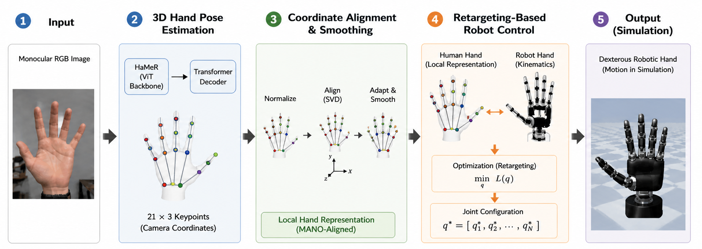
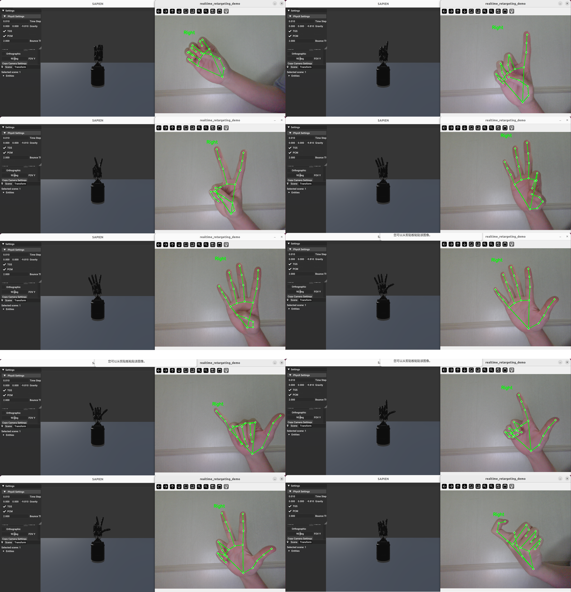

# Kinematic-Control-of-Robotic-Hands-Based-on-a-Monocular-RGB-Cammera

Vision-based teleoperation pipeline for dexterous robotic hands using only a monocular RGB camera.  
It combines hand detection, 3D hand pose reconstruction, coordinate normalization and optimization-based retargeting to control robotic hands in a physics simulator.

<p align="center">
  
</p>

<p align="center">
  
</p>


**Goal:** Map human hand motion from a standard RGB camera to joint commands of a dexterous robotic hand – no gloves, no depth cameras.

---

## Overview

- **MediaPipe Hands** – real-time hand detection
- **HaMeR** – monocular 3D hand pose reconstruction
- **Hand-centric normalization** – removes global wrist position/orientation
- **DexPilot-style retargeting** – maps human features to robot joint space
- **SAPIEN** – real-time robotic hand simulation

---

## Pipeline
Monocular RGB Camera
↓
MediaPipe Hand Detection
↓
HaMeR 3D Hand Pose Estimation
↓
Hand-Centric Coordinate Transformation
↓
Dexterous Hand Retargeting
↓
SAPIEN Robot Hand Simulation


---

## Features

- Monocular RGB-based dexterous hand teleoperation
- No data glove or depth camera needed
- Real-time hand detection (MediaPipe)
- 21 keypoints 3D reconstruction (HaMeR)
- Hand-centric coordinate normalization
- Vector-based / position-based retargeting
- Multi-process camera capture with latest-frame-only strategy
- Temporal smoothing for reduced jitter
- Supports multiple dexterous robotic hands

---

## Method (simplified)

1. **Hand Detection**  
   MediaPipe detects the hand region, 2D landmarks and handedness. Only one hand is processed at a time.

2. **3D Hand Pose Estimation**  
   The hand crop is sent to HaMeR, which outputs 21 3D keypoints (wrist + 4 finger joints per finger).

3. **Coordinate Transformation**  
   Keypoints are translated to a wrist-centred frame and rotated to a canonical hand coordinate system, preserving only finger articulation.

4. **Retargeting & Robot Control**  
   An optimisation problem minimises the difference between human hand features (e.g. keypoint vectors) and robot hand features. The resulting joint angles drive the SAPIEN simulation.

---

## Real-Time Design

- **Producer process**: continuously captures camera/video frames.
- **Consumer process**: runs detection, pose estimation, retargeting and rendering.
- **Latest-frame strategy**: only the newest frame is processed; outdated frames are dropped.
- **Temporal smoothing**: exponential smoothing on hand keypoints reduces jitter.

---

## Supported Robotic Hands

Allegro Hand, Shadow Hand, LEAP Hand, DClaw, Ability Hand, Barrett Hand, SVH Hand.  
Models are loaded from URDFs in the `hands/` directory.

## Installation

### Recommended Environment

| Item | Recommended |
|---|---|
| OS | Ubuntu 20.04 |
| Python | Python 3.10 |
| GPU | NVIDIA RTX 4060 or better |
| Camera | Standard monocular RGB webcam |

A CUDA-enabled GPU is recommended for real-time HaMeR inference.

---

### Install HaMeR

This project uses HaMeR for monocular RGB-based 3D hand pose reconstruction.

Please refer to the official HaMeR repository for detailed installation:

```text
https://github.com/geopavlakos/hamer
```

Typical installation:

```bash
git clone https://github.com/geopavlakos/hamer.git
cd hamer
pip install -e .[all]
pip install -v -e third-party/ViTPose
bash fetch_demo_data.sh
cd ..
```

HaMeR also requires the MANO hand model. Please download it from the official MANO website and place it according to the HaMeR instructions.

---

### Install dex-retargeting

This project uses `dex-retargeting` for optimization-based human-to-robot hand motion retargeting.

Please refer to the official dex-retargeting repository for detailed installation:

```text
https://github.com/dexsuite/dex-retargeting
```

Typical installation:

```bash
git clone https://github.com/dexsuite/dex-retargeting.git
cd dex-retargeting
pip install -e .
cd ..
```
